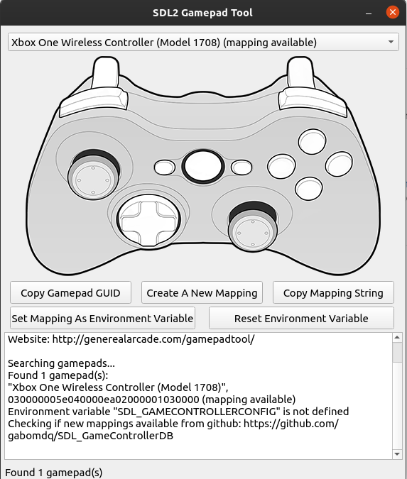

# Super Street Fighter 2 - Tribute

Tested on Ubuntu 23.10 and Mac OS Sonoma

Credits [Oriol Romero](https://github.com/nacca)

## TODO
* [x] Cross building platform
* [x] Xbox controller mapping
* [ ] Xbox port
* [ ] PSVita port
* [ ] Android port
* [ ] Intro Scene
* [ ] Character selector scene
* [ ] New characters

# Dep

* make
* cmake
* g++
* sdl2, image, mixer
* libjsoncpp

or

```
make dep
```

# Build

    make build

# Run

    make run


Controls

| Key  | Actions|
|------|--------|      
|esc   | Quit   | 
|space | Restart|
|z     | Show colliders|


Player 1
| Key  | Actions|
|------|--------|      
|i | jump  | 
|k | crouch |
|l | foward |
|j | backward |
|a | lower punch |
|s | medium punch |
|d | higher punch |
|q | lower kick |
|w | medium kick |
|e | high kick |

Player 2
| Key  | Actions|
|------|--------|      
|arrow up | jump | 
|arrow down | crouch |
|arrow left | foward |
|arrow right | backward |
|button x| lower punch |
|button y| medium punch |
|button ?| higher punch |
|button a | lower kick |
|button b | medium kick |
|button ?| high kick |


Xbox One Wireless Controller (Model 1708)



 [Gamepad Tool](http://generalarcade.com/gamepadtool)


# Ref

* [Github](https://github.com/nacca/SSF2)
* [YouTube](https://youtu.be/RwYQWtHCgrI=)
* [SDL GamePad](http://generalarcade.com/gamepadtool/)
